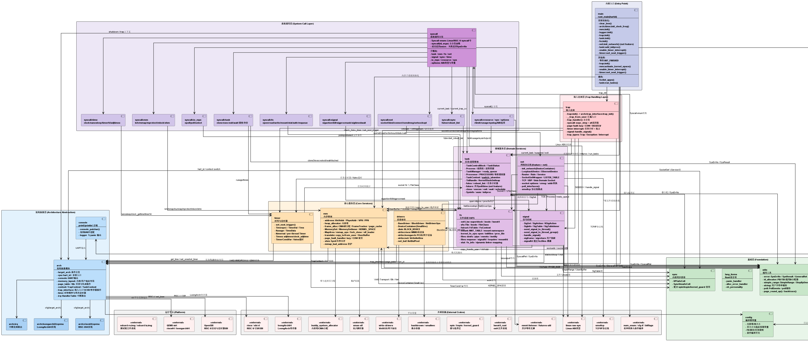

# 第一章 概述

## 1.1 项目背景

Ya2yOS 是一个基于 Rust 语言开发的宏内核操作系统，支持 **RISC-V64** 和 **LoongArch64** 两种处理器架构。项目起源于 2025 年全国大学生系统能力大赛操作系统设计赛（内核实现赛道），以 TatlinOS 为基础进行持续演进。内核采用 SV39（RISC-V）/ LA64 分页机制，使用 Rust 语言实现内存安全与零成本抽象，整体架构参考了 Linux 内核的设计理念，同时借鉴了 xv6 和 rCore 等教学内核的简洁性。

## 1.2 设计目标

Ya2yOS 的核心设计目标是提供一个 **Linux 兼容** 的综合型操作系统内核。具体而言：

1. **系统调用兼容**：实现了 200+ 个 Linux 兼容的系统调用，能够运行 glibc libc-test 测试套件，支持 BusyBox 等复杂用户态程序；
2. **完整的进程模型**：支持 fork/clone/clone3 多线程创建、execve 程序加载、完善的父子进程管理和 waitpid 机制；
3. **现代虚拟内存管理**：SV39 三级页表，支持 mmap/munmap/mprotect/brk 等内存管理系统调用，实现写时复制（COW）、共享内存（SHM）、按需分页（Demand Paging）等特性；
4. **POSIX 信号机制**：完整的 Linux 信号框架，支持自定义信号处理函数（sigaction）、信号栈帧（sigframe）、rt_sigreturn、signalfd 等高级特性；
5. **TCP/IP 网络协议栈**：集成 smoltcp 协议栈，支持 TCP、UDP、Unix Domain Socket，通过 VirtIO 网络设备与外界通信；
6. **ext4 文件系统支持**：通过 lwext4_rust 绑定，原生支持 ext4 文件系统，提供完整的 VFS 抽象层；
7. **双架构支持**：内核通过条件编译和架构抽象层，同时支持 RISC-V64 和 LoongArch64 指令集架构。

## 1.3 系统架构概览

Ya2yOS 采用经典的 **宏内核（Monolithic Kernel）** 架构，所有核心子系统运行在内核态（S-Mode），共用一个地址空间。内核模块组织如下：

```
os/src/
├── main.rs              # 内核入口，初始化各子系统
├── config.rs            # 内核编译期常量配置
├── arch/                # 架构相关代码
│   ├── riscv64/         # RISC-V64 架构实现
│   ├── loongarch64/     # LoongArch64 架构实现
│   └── irq/             # 中断处理表
├── trap/                # 陷入处理（Trap Handler）
├── syscall/             # 系统调用分发与实现
│   ├── task/            # 进程/线程管理类系统调用
│   ├── mm/              # 内存管理类系统调用
│   ├── fs/              # 文件系统类系统调用
│   ├── net/             # 网络类系统调用
│   ├── signal/          # 信号类系统调用
│   ├── sync/            # 同步类系统调用（futex 等）
│   ├── time/            # 时间类系统调用
│   └── io_mpx/          # IO 多路复用（epoll/poll/select）
├── task/                # 任务管理
│   ├── task/            # TaskControlBlock（TCB）
│   ├── process/         # Process（进程/线程组）
│   ├── manager.rs       # 全局任务管理器
│   ├── processor.rs     # 每核处理器调度器
│   └── futex.rs         # 快速用户空间互斥锁
├── mm/                  # 内存管理
│   ├── memory_set/      # 内存集合（MemorySet）
│   ├── frame_alloc/     # 物理帧分配器（CMA 伙伴系统）
│   ├── map_area.rs      # 映射区域（MapArea）
│   ├── translate.rs     # 地址转换与用户数据读写
│   ├── page_fault_handler.rs  # 缺页异常处理
│   └── shm.rs           # 共享内存
├── fs/                  # 文件系统
│   ├── ext4_lw/         # ext4 文件系统实现（基于 lwext4）
│   ├── files/           # 各类文件实现（普通文件、管道、epoll 等）
│   ├── vfs.rs           # 虚拟文件系统接口
│   ├── mount.rs         # 挂载管理
│   └── kernel_fs_ops/   # 内核文件操作
├── net/                 # 网络协议栈
│   ├── tcp.rs           # TCP 套接字
│   ├── udp.rs           # UDP 套接字
│   ├── unix.rs          # Unix Domain Socket
│   ├── socket.rs        # 套接字抽象
│   └── service.rs       # 网络服务轮询
├── drivers/             # 设备驱动
│   ├── virtio/          # VirtIO 总线驱动
│   ├── disk.rs          # 块设备抽象
│   ├── device.rs        # 驱动抽象接口
│   └── net/             # 网络设备抽象
├── signal/              # 信号机制
│   ├── signal.rs        # 信号集与信号发送
│   └── sigact.rs        # 信号表与信号动作
├── timer/               # 定时器管理
├── sync/                # 内核同步原语
└── utils/               # 工具模块
```

## 1.4 内核启动流程

内核启动过程分为以下几个步骤：

1. **硬件初始化**：由 OpenSBI（RISC-V）或 UEFI（LoongArch）引导，跳转到内核入口 `_start`，完成 BSS 段清零和栈初始化；
2. **trampoline**：对于 RISC-V64，内核镜像直接映射在虚拟地址高段（`0xffffffc000000000` 偏移），通过 trampoline 跳转到 `rust_main`；
3. **`rust_main`（第一个 Hart）**：
   - 清零 BSS 段
   - 初始化时钟频率
   - 初始化内存管理子系统（内核堆、CMA 物理帧分配器、内核页表激活）
   - 初始化日志系统
   - 初始化陷阱处理（设置 `stvec` 指向 `__alltraps`）
   - 初始化任务管理器
   - 初始化文件系统（挂载 ext4 根文件系统，创建 /proc 目录）
   - 初始化网络子系统（探测 VirtIO 网络设备、配置 smoltcp 协议栈、添加路由规则）
   - 从根文件系统加载 initproc ELF 可执行文件并加入就绪队列
   - 使能时钟中断，开始调度执行
4. **`rust_main`（其他 Hart）**：自旋等待初始化完成，然后初始化自己的陷阱处理和任务执行上下文，参与调度。
5. **`run_tasks()`**：开始第一个用户态进程的执行。

## 1.5 系统调用接口

Ya2yOS 实现了 200+ 个系统调用，涵盖以下类别（部分代表性系统调用）：

| 类别 | 代表系统调用 | 说明 |
|------|-------------|------|
| 进程管理 | `clone`, `clone3`, `execve`, `exit`, `exit_group`, `wait4`, `set_tid_address` | 线程创建、程序执行、进程终止与等待 |
| 内存管理 | `mmap`, `munmap`, `mprotect`, `brk`, `mremap`, `shmget`, `shmat`, `shmctl` | 虚拟内存映射、堆管理、共享内存 |
| 文件系统 | `openat`, `close`, `read`, `write`, `lseek`, `mkdirat`, `unlinkat`, `getdents64`, `statx`, `mount`, `fstat`, `renameat2` | 文件与目录的完整 CRUD 操作 |
| 信号机制 | `sigaction`, `sigprocmask`, `kill`, `tkill`, `tgkill`, `sigsuspend`, `sigreturn`, `signalfd4` | 信号处理全流程 |
| 网络 | `socket`, `bind`, `listen`, `accept`, `connect`, `sendto`, `recvfrom`, `sendmsg`, `recvmsg`, `setsockopt` | BSD Socket 接口完整实现 |
| 同步 | `futex`, `set_robust_list`, `get_robust_list` | 用户态同步原语 |
| 时间 | `clock_gettime`, `nanosleep`, `timerfd_create`, `clock_nanosleep`, `gettimeofday` | 高精度定时 |
| IO多路复用 | `epoll_create1`, `epoll_ctl`, `epoll_pwait`, `ppoll`, `pselect6`, `eventfd2` | 高性能 IO 事件通知 |

系统调用的分发采用 Rust 的 `enum` 模式匹配，通过 `Syscall::from(syscall_id)` 将数字 ID 转换为枚举类型，然后在 `syscall()` 函数中通过 `match` 语句分发到对应的处理函数。RISC-V64 架构下，用户态通过 `ecall` 指令陷入内核，参数通过 a0-a5 寄存器传递，返回值通过 a0 返回。

## 1.6 关键技术与创新点

1. **双架构抽象**：通过 `cfg_if` 和条件编译将架构相关代码隔离在 `arch/` 目录下，`trait` 接口定义了统一的上下文切换、页表操作、中断处理等抽象方法，实现了 RISC-V64 和 LoongArch64 两套架构的透明支持；
2. **Rust 内存安全**：利用 Rust 的所有权系统、`Arc` 智能指针和 `Spin` 锁等机制，在内核中实现了内存安全的数据结构。通过 `SyncUnsafeCell` 等机制在保证性能的前提下实现了安全的内部可变性；
3. **精细的 COW 实现**：fork 时父进程所有可写页被标记为只读并设置 COW 标志，子进程共享同一物理帧；仅在实际写入时触发缺页异常（StorePageFault）进行物理帧的深度复制；Brk 堆区域也支持 COW 按页分配；
4. **Linux ABI 深度兼容**：实现了包括 `robust_list`、`clear_child_tid`、`CLONE_CHILD_CLEARTID`等在内的复杂 Linux 特性，使得 glibc 等标准库能近乎无修改运行，通过了 libc-test 的大量测试用例；
5. **异步网络轮询**：smoltcp 协议栈的 `poll_interfaces` 机制集成在时钟中断处理路径中，结合 epoll 实现高效的网络 IO 事件通知；
6. **基于 lwext4 的 ext4 文件系统**：通过 Rust FFI 绑定 C 语言的 lwext4 库，在内核态直接提供了完整的 ext4 文件系统支持。通过 `BlockDriver` trait 将 VirtIO 块设备抽象为 lwext4 所需的块设备接口，实现了从物理块设备到文件系统的完整 IO 栈；
7. **Wait-Die 死锁预防**：在内存管理（mmap/munmap/mprotect 等操作）和文件系统操作中，对多级锁的获取采用确定的顺序，并结合 `try_lock` 与重试机制，避免了内核中的锁死锁。

## 1.7 开发与构建

项目使用 Makefile 组织构建流程，支持以下主要构建命令：

- `make run`：在 QEMU 上以默认配置运行 RISC-V64 版本
- `make run LOG=<level>`：指定日志输出等级（error/warn/info/debug/trace）
- `make run ACC=1`：启用多核（SMP）启动
- `make run FEATURES=net`：启用网络功能
- `make build LOG=trace`：构建带 trace 日志输出的内核
- `make gdb`：以 GDB 调试模式启动
- `make justfile`：使用 just 工具进行更灵活的构建配置

内核依赖的主要外部 crate 包括：

| Crate | 用途 |
|-------|------|
| `smoltcp` | 用户态 TCP/IP 协议栈 |
| `virtio-drivers` | VirtIO 总线与设备驱动框架 |
| `lwext4_rust` | ext4 文件系统的 Rust FFI 绑定 |
| `linux-raw-sys` | Linux 类型定义（信号、网络、文件等） |
| `buddy_system_allocator` | 伙伴系统物理内存分配器 |
| `xmas-elf` | ELF 可执行文件解析 |
| `spin` | 自旋锁（内核态同步原语） |
| `hashbrown` | 高性能哈希表 |
| `futures-util` | 异步编程工具 |

以下是内核各个模块的依赖关系：

