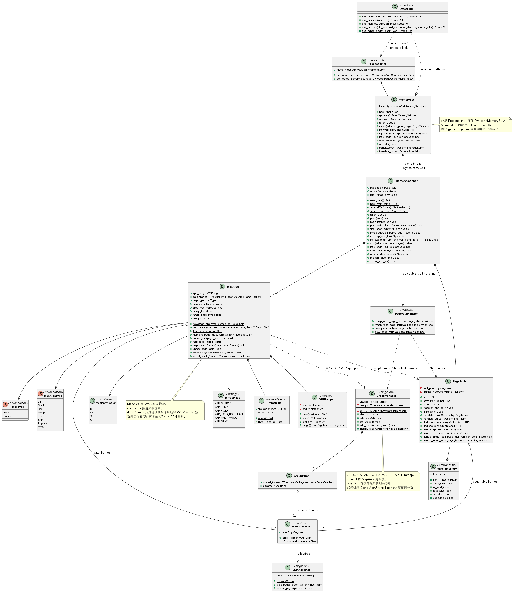
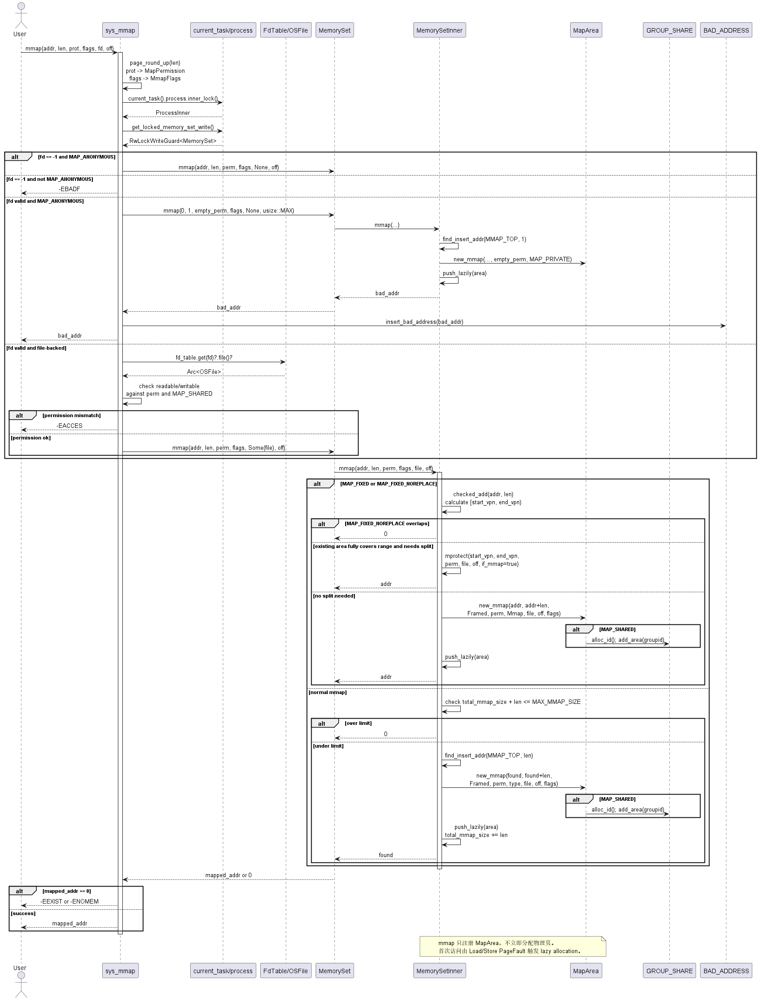
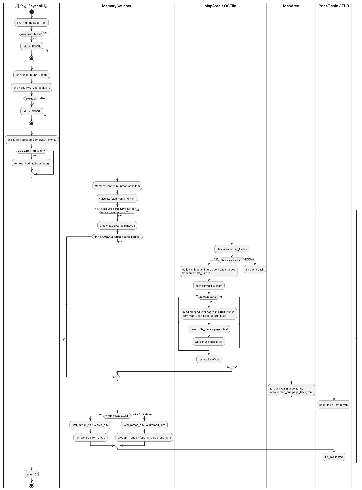
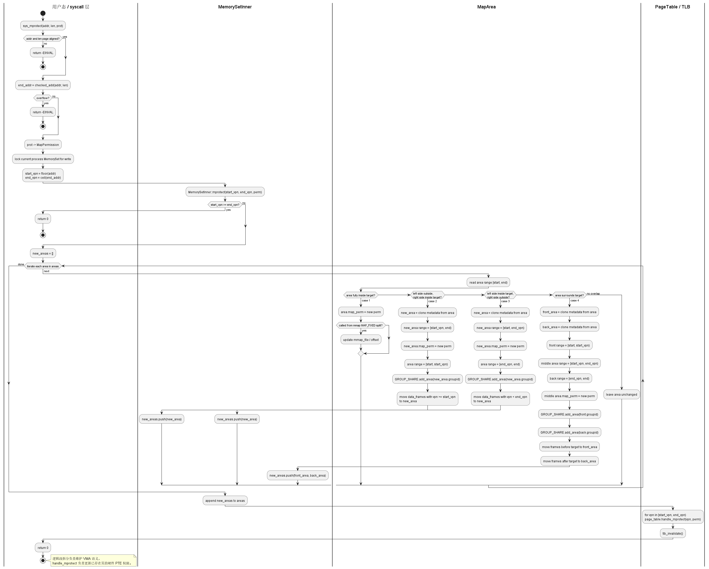
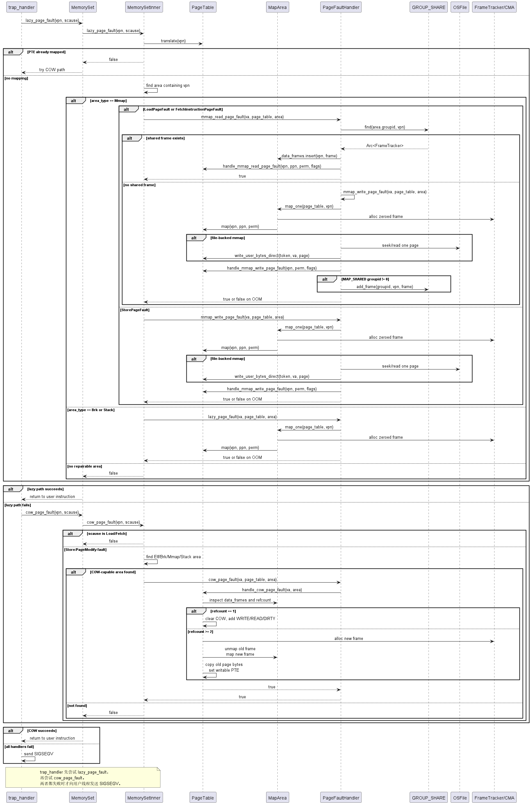

# 第三章 内存管理

内存管理子系统是 Ya2yOS 内核的基础设施，代码位于 `os/src/mm/` 目录下，包含以下源文件：

| 文件 | 职责 |
|------|------|
| `mod.rs` | 模块入口：类型导出、`VPNRange` 定义、`bitflags!`（`MremapFlags`）、`init()` |
| `address.rs` | 地址/页号类型定义：`PhysAddr`、`VirtAddr`、`KernelAddr`、`PhysPageNum`、`VirtPageNum` 的转换与运算 |
| `heap_allocator.rs` | 全局内核堆分配器（`LockedHeap`）与 `ContinuousPages` 连续页分配 |
| `frame_alloc/` | 物理帧管理：CMA 伙伴系统分配器（`buddy_cma.rs`）、`FrameTracker` RAII 封装、页缓存 |
| `map_area.rs` | `MapArea` 逻辑段定义：页映射/解映射、数据拷贝、`MapType`/`MapAreaType`/`MapPermission` |
| `memory_set/` | `MemorySet` 核心抽象与子模块：ELF 加载、fork/clone、mmap/munmap/mprotect、内核初始化 |
| `page_fault_handler.rs` | 缺页异常回调：`lazy_page_fault`、`cow_page_fault`、`mmap_read/write_page_fault` |
| `translate.rs` | 地址转换与安全跨空间数据传输：`copy_from_user`、`copy_to_user`、`UserBuffer`、`read_user_cstr` |
| `group.rs` | `GROUP_SHARE`：MAP_SHARED mmap 区域的跨进程共享帧管理器 |
| `shm.rs` | System V 共享内存：`ShmManager`、`shmget`/`shmat`/`shmctl` |
| `mmap_bad_address.rs` | 坏地址表：防止 mmap 与已加载区域冲突的特殊标记地址 |



---

## 3.1 地址空间布局

### 3.1.1 物理内存布局

RISC-V64 架构下，物理内存的起始地址为 `0x8000_0000`，默认配置 1GB 物理内存空间（`PHYSICAL_MEMORY_SIZE = 0x4000_0000`）。QEMU 模拟的 MMIO 区域分布在物理地址低位：

| 地址范围 | 设备 |
|---------|------|
| `0x0010_0000` | VIRT_TEST |
| `0x0010_1000` | VIRT_RTC |
| `0x1000_0000` | UART0 |
| `0x1000_1000` | VirtIO Block |
| `0x1000_2000` | VirtIO Net |

内核通过 `KERNEL_ADDR_OFFSET = 0xffffffc000000000` 将物理内存直接映射到内核虚拟地址空间的高段（Direct Mapping），实现物理地址与内核虚拟地址的简单转换：

```rust
// kva = pa + KERNEL_ADDR_OFFSET
impl From<PhysAddr> for KernelAddr {
    fn from(v: PhysAddr) -> Self { Self(v.0 + KERNEL_ADDR_OFFSET) }
}
impl From<KernelAddr> for PhysAddr {
    fn from(v: KernelAddr) -> Self { Self(v.0 - KERNEL_ADDR_OFFSET) }
}
```

内核代码段、数据段和 BSS 段在启动时由引导加载器加载到 `PHYSICAL_MEMORY_START` 起始处，CMA 分配器从内核结束位置（`ekernel` 符号）之后开始管理剩余物理内存。MMIO 设备也通过 Direct Mapping 映射到内核地址空间（`MMIO_MAP_OFFSET = KERNEL_ADDR_OFFSET`），`MapAreaType::MMIO` 类型的区域直接将 VPN 偏移转换为物理地址，无需分配物理帧：

```rust
// map_area.rs: 对于 MMIO 区域，vpn 直接映射到物理地址
if self.area_type == MapAreaType::MMIO {
    ppn = PhysPageNum(vpn.0 - (MMIO_MAP_OFFSET >> PAGE_SIZE_BITS));
    page_table.map(vpn, ppn, self.map_perm);
    return Some(ppn);
}
```

### 3.1.2 内核虚拟地址空间布局

内核地址空间（`KERNEL_SPACE`）采用 **大页映射（2MB/1GB）** 将全部物理内存通过恒等偏移映射到高段虚拟地址，以提升 TLB 覆盖率。内核地址空间的具体布局：

```
KERNEL_ADDR_OFFSET ─────────────────────────────
                    │  内核代码段 (.text)        │
                    ├────────────────────────────┤
                    │  内核只读数据 (.rodata)     │
                    ├────────────────────────────┤
                    │  内核数据 (.data/.bss)     │
                    ├────────────────────────────┤
                    │  CMA 管理的空闲物理内存     │ ← Direct Mapping
                    │  (伙伴系统，4KB页粒度)      │
                    ├────────────────────────────┤
                    │  内核堆 (48MB)             │ ← 独立映射，虚拟连续
                    │  LockedHeap 动态分配        │
                    ├────────────────────────────┤
                    │  内核栈区                   │ ← 每线程16KB (4页)
                    │  (KSTACK_TOP 附近)         │
KERNEL_ADDR_OFFSET + PHYSICAL_MEMORY_SIZE ──────
```

内核堆使用独立的虚拟地址映射而非 Direct Mapping，因为伙伴分配器（`LockedHeap`）需要连续的虚拟地址空间。

### 3.1.3 用户虚拟地址空间布局

每个进程拥有独立的 192GB（`0x30_0000_0000`）用户态虚拟地址空间，布局从低地址到高地址依次为：

```
0x0000_0000_0000 ───────────────────────────────
                  │  ELF 各段（代码/数据/BSS）   │ ← 从0开始，由 from_elf 加载
                  │  MapAreaType::Elf           │
                  ├──────────────────────────────┤
                  │  Guard Page (1页)           │ ← 防止 ELF 段溢出到堆
                  ├──────────────────────────────┤
                  │  Brk 堆区域                  │ ← MapAreaType::Brk
                  │  (虚拟预留512MB,              │   user_heap_bottom→user_heappoint
                  │   实际增长上限512MB)           │   延迟分配，按需增长
                  ├──────────────────────────────┤
                  │  动态链接器映射段             │ ← DL_INTERP_OFFSET=0x15_0000_0000
                  │  MapAreaType::Elf           │   固定偏移，与 ELF 不重叠
                  ├──────────────────────────────┤
                  │  Mmap 映射区域                │ ← MapAreaType::Mmap / Stack
                  │  (总量上限 512MB)             │   从 MMAP_TOP 向下生长
                  ├──────────────────────────────┤
                  │  Guard Page (1页)           │
                  ├──────────────────────────────┤
                  │  线程用户栈 (8MB×N)            │ ← MapAreaType::Stack
                  ├──────────────────────────────┤
                  │  TrapContext 页 (N个，每线程1页) │ ← MapAreaType::Trap
0x30_0000_0000 ───────────────────────────────
```

关键常量定义（`os/src/arch/riscv64/qemu/memory_layout.rs`）：

| 常量 | 值 | 说明 |
|------|-----|------|
| `PAGE_SIZE` | `0x1000` (4KB) | 页大小 |
| `PAGE_SIZE_BITS` | `12` | 页内偏移位数 |
| `USER_STACK_SIZE` | `8MB` | 每线程用户栈大小 |
| `KERNEL_STACK_SIZE` | `16KB` (4页) | 每线程内核栈大小 |
| `KERNEL_HEAP_SIZE` | `48MB` | 内核堆大小 |
| `USER_HEAP_SIZE` | `512MB` | 堆虚拟预留空间 |
| `MAX_BRK_SIZE` | `512MB` | 堆实际增长上限 |
| `MAX_MMAP_SIZE` | `512MB` | mmap 总量上限 |
| `USER_SPACE_SIZE` | `0x30_0000_0000` (192GB) | 用户地址空间总大小 |
| `DL_INTERP_OFFSET` | `0x15_0000_0000` | 动态链接器固定映射偏移 |

地址计算公式：
- `USER_TRAP_CONTEXT_TOP = USER_SPACE_SIZE`（192GB 顶部）
- `USER_STACK_TOP = USER_TRAP_CONTEXT_TOP - PAGE_SIZE * THREAD_MAX_NUM`
- `MMAP_TOP = USER_TRAP_CONTEXT_TOP - PAGE_SIZE * THREAD_MAX_NUM - USER_STACK_SIZE * THREAD_MAX_NUM - PAGE_SIZE`

这确保了 TrapContext 页在最高地址，用户栈次之，中间有 Guard Page 隔离，mmap 区域从 `MMAP_TOP` 向下分配。

---

## 3.2 页表机制

### 3.2.1 SV39 三级页表

RISC-V64 架构采用 SV39 分页方案，虚拟地址的 39 位被划分为三级索引和页内偏移：

```
虚拟地址 (39 bits):
┌──────────┬──────────┬──────────┬────────────┐
│  VPN[2]  │  VPN[1]  │  VPN[0]  │   offset   │
│  9 bits  │  9 bits  │  9 bits  │  12 bits   │
└──────────┴──────────┴──────────┴────────────┘
   L2 索引    L1 索引    L0 索引     页内偏移
```

`VirtPageNum` 的 `indexes()` 方法提取三级页表索引：

```rust
pub fn indexes(&self) -> [usize; 3] {
    let mut vpn = self.0;
    let mut idx = [0usize; 3];
    for i in (0..3).rev() {
        idx[i] = vpn & 511;
        vpn >>= 9;
    }
    idx
}
```

### 3.2.2 页表项标志位（RVPTEFlags）

RISC-V64 页表项使用 `RVPTEFlags` 位掩码控制每页的访问属性，定义于 `os/src/arch/riscv64/qemu/page_table.rs`：

```rust
bitflags! {
    pub struct RVPTEFlags: usize {
        const VALID      = 1 << 0;  // 有效位 (V)
        const READABLE   = 1 << 1;  // 可读 (R)
        const WRITEABLE  = 1 << 2;  // 可写 (W)
        const EXECUTABLE = 1 << 3;  // 可执行 (X)
        const USER       = 1 << 4;  // 用户态可访问 (U)
        const GLOBAL     = 1 << 5;  // 全局映射 (G)
        const ACCESSED   = 1 << 6;  // 已访问 (A)
        const DIRTY      = 1 << 7;  // 已修改 (D)
        const COW        = 1 << 9;  // 写时复制标记 (自定义)
        const RESERVED_10 = 1 << 10; // 保留位
    }
}
```

其中 **`COW` 位（bit 9）是 Ya2yOS 自定义的软件标志位**，RISC-V 规范中该位为保留位（留给 S-mode 软件使用）。当页面被 fork 共享时，内核将该位置 1 并移除 `WRITEABLE` 位，后续写操作触发 StorePageFault 时，内核根据此标志判断需要执行 COW 深拷贝。

`MapPermission` 与 `RVPTEFlags` 之间可以互相转换（定义于同一文件），转换时自动附加 `VALID` 标志，确保映射完成后 PTE 有效。

### 3.2.3 PageTable 结构体

`PageTable` 封装了根页表物理地址和页表自身占用的物理帧列表：

```rust
pub struct PageTable {
    root_ppn: PhysPageNum,          // 根页表物理页号（即 satp.PPN）
    frames: Vec<Arc<FrameTracker>>, // 页表各级中间页占用的物理帧
}
```

`frames` 持有对页表中间页的引用计数，确保页表使用的物理帧不会被 CMA 分配器回收。重点方法：

- **`find_pte_create(vpn)`**：遍历三级页表查找页表项。若中途发现中间页不存在（PTE 无效），自动分配新物理帧并创建中间页。**但不会分配最终数据页**——这是懒分配的关键前提。
- **`find_pte(vpn)`**：只读遍历，不创建中间页。用于查询映射是否存在。
- **`translate(vpn)`**：返回有效 PTE 对应的物理页号，PTE 无效或不存在返回 `None`。

### 3.2.4 内核地址空间与用户页表

内核拥有一个全局的 `KERNEL_SPACE`（`Lazy<Mutex<MemorySetInner>>`），所有 Hart 共享。内核页表采用大页映射以提升 TLB 覆盖率。

用户进程创建时，调用 `PageTable::new_from_kernel()` 构造用户页表：分配一个新的根页表帧，**仅拷贝内核空间的 L2 索引对应的页表项**（即 `KERNEL_PGNUM_OFFSET` 对应的 VPN[2] 索引），使用户页表天然具备内核空间的高段映射：

```rust
pub fn new_from_kernel() -> Self {
    let frame = FrameTracker::alloc().unwrap();
    let kernel_root_ppn = KERNEL_SPACE.lock().page_table.root_ppn;
    let index = VirtPageNum::from(KERNEL_PGNUM_OFFSET).indexes()[0];
    frame.ppn.as_array::<PageTableEntry>()[index..]
        .copy_from_slice(&kernel_root_ppn.as_array::<PageTableEntry>()[index..]);
    PageTable { root_ppn: frame.ppn, frames: vec![frame] }
}
```

这样，用户态陷入内核时无需切换页表——内核地址空间在用户页表中直接可用，`stvec` 指向的 `__alltraps` 可直接在内核页表下执行。

### 3.2.5 页表的架构特定操作

与页表相关的特化函数以 `handle_xxx` 命名，目的由页表维护页表一致性、便于问题排查：

| 方法 | 功能 |
|------|------|
| `handle_mprotect(vpn, flags)` | 修改指定虚拟页的 PTE 权限位（位或操作添加权限） |
| `handle_cow_page_fault(va, vma)` | COW 缺页处理：检查引用计数，执行深拷贝或直接恢复权限 |
| `handle_cow_mapping_from_exited_user(vpn, ms)` | fork 时将父进程可写 PTE 转为 COW 只读，在子进程创建相同 PTE |
| `handle_mmap_read_page_fault(vpn, ppn, ...)` | mmap 读触发分配后，设置 PTE 标志（MAP_SHARED→DIRTY，MAP_PRIVATE→COW） |
| `handle_mmap_write_page_fault(vpn, vma, ...)` | mmap 写触发分配后，设置 PTE 标志（同上，对已存在 PTE 做位或合并） |

---

## 3.3 地址空间 MemorySet

### 3.3.1 结构定义

`MemorySet` 是管理虚拟地址空间的核心抽象。每个 Process 通过 `Arc<RwLock<MemorySet>>` 共享同一个地址空间：

```rust
pub struct MemorySet {
    pub inner: SyncUnsafeCell<MemorySetInner>,
}

pub struct MemorySetInner {
    pub page_table: PageTable,        // SV39 页表
    pub areas: Vec<MapArea>,          // 所有映射区域（逻辑段）的向量，有序排列
    pub total_mmap_size: usize,       // mmap 累计分配的虚拟内存总量（字节）
}
```

**`SyncUnsafeCell` 设计模式**：`MemorySet` 使用 `SyncUnsafeCell<MemorySetInner>` 而非直接包装 `Mutex`/`RwLock`，因为并发控制由外层的 `RwLock<MemorySet>` 保证。`get_mut()` 和 `get_ref()` 通过 `get_unchecked_mut`/`get_unchecked_ref` 直接访问内部数据，避免双重锁开销。但这也要求调用者必须持有外层锁。

### 3.3.2 映射区域（MapArea）

每个 `MapArea` 代表地址空间中一段连续的虚拟页面范围，记录该范围的映射类型、权限和数据帧：

```rust
pub struct MapArea {
    pub vpn_range: VPNRange,                          // 虚拟页号范围（左闭右开）
    pub data_frames: BTreeMap<VirtPageNum, Arc<FrameTracker>>, // VPN→物理帧映射
    pub map_type: MapType,                            // Direct 或 Framed
    pub map_perm: MapPermission,                      // R/W/X/U 权限
    pub area_type: MapAreaType,                       // 区域用途类型
    pub mmap_file: MmapFile,                          // mmap 文件映射（文件和偏移）
    pub mmap_flags: MmapFlags,                        // MAP_SHARED/PRIVATE 等
    pub groupid: usize,                               // GROUP_SHARE 组 ID（MAP_SHARED 使用）
}
```

**`data_frames` 的双重追踪机制**：为什么 `MapArea` 中有 `data_frames` 而 `PageTable` 的 PTE 中已经有 VPN→PPN 的映射？原因在于：

1. **引用计数管理**：`data_frames` 中的 `Arc<FrameTracker>` 提供了物理帧的引用计数，是 COW 机制的基础。PTE 中只有 PPN，无法获知共享计数。
2. **生命周期管理**：`data_frames` 通过 RAII 管理物理帧的分配与释放。当 `MapArea` 被 Drop 时，`data_frames` 中的所有 `FrameTracker` 也随之 Drop，物理帧被归还 CMA。
3. **共享内存追踪**：`MAP_SHARED` 区域通过 `groupid` 在 `GROUP_SHARE` 中注册，`data_frames` 中的帧可以跨进程共享。

`MapType` 定义了映射方式：

| 类型 | 说明 | 使用场景 |
|------|------|---------|
| `Direct` | VPN 与 PPN 有固定偏移关系（`ppn = vpn - KERNEL_PGNUM_OFFSET`） | 内核 Direct Mapping 区域 |
| `Framed` | 逐帧分配，通过 `FrameTracker` 管理 | 用户态所有区域、内核堆 |

`MapAreaType` 定义了区域的用途：

| 类型 | 用途 | 懒分配 | COW |
|------|------|--------|-----|
| `Elf` | ELF 代码和数据段 | ❌（exec 时完整加载） | ✅（fork 时共享） |
| `Stack` | 用户栈（主线程或 mmap 栈） | ✅（按需增长） | ✅ |
| `Brk` | 堆区域 | ✅（brk 系统调用仅更新范围） | ✅ |
| `Mmap` | mmap 映射区域（匿名或文件映射） | ✅ | ✅（MAP_PRIVATE） |
| `Trap` | TrapContext 页面 | ❌ | ❌（fork 时不复制） |
| `Shm` | 共享内存段 | ❌（attach 时完整分配） | ❌（始终共享） |
| `Physical` | 内核物理帧映射 | ❌ | ❌ |
| `MMIO` | 内核 MMIO 映射 | ❌（直接偏移转换） | ❌ |

### 3.3.3 MapArea 的核心操作

**`map_one` — 单页映射**：为指定 VPN 分配物理帧（Framed 类型）或直接计算偏移（Direct/MMIO 类型），并在页表中建立映射。对 Framed 类型，从 CMA 分配新帧并插入 `data_frames`；对 Direct 类型，通过 `vpn - KERNEL_PGNUM_OFFSET` 计算物理页号。

**`unmap_one` — 单页解映射**：从页表移除 PTE，并从 `data_frames` 中移除帧追踪器（触发 Drop 归还物理内存）。

**`copy_data` — 分页数据拷贝**：将数据分段拷贝到已映射的物理帧中，处理跨页边界和偏移。通过循环中计算 `PAGE_SIZE - page_offset` 确定每页可拷贝的长度，正确穿越页边界。

### 3.3.4 虚拟地址空间管理

**`find_insert_addr` — 冲突检测与地址分配**：从 `hint` 地址向低地址方向递归搜索，找到一个不与任何已有 area 重叠的 `size` 大小的空闲区间。若检测到冲突，将 hint 移到冲突区域下方（`conflict_start_vpn - PAGE_SIZE`），递归重新搜索。

**`push` / `push_lazily` / `push_with_given_frames`**：
- `push`：立即分配物理帧并建立页表映射（适用于 ELF 段、TrapContext 等）；
- `push_lazily`：仅注册 `MapArea` 到 `areas` 向量，帧的分配延迟到首次缺页异常时（适用于 Brk、mmap、COW 克隆等）；
- `push_with_given_frames`：使用预先分配的物理帧列表创建映射（适用于 fork 后的 MAP_SHARED 和 Shm 区域）。

---

## 3.4 物理内存分配

### 3.4.1 CMA 连续内存分配器

物理内存管理采用 **CMA（Contiguous Memory Allocator）** 架构，底层使用 `buddy_system_allocator` 提供的 `LockedHeap` 进行页面粒度的分配与回收。CMA 基于伙伴系统算法，支持按 2 的幂次方页面数分配连续物理内存。

**初始化流程**（`init_cma` → `init_cma_heap`）：

1. 获取内核结束位置 `ekernel` 符号的虚拟地址；
2. 计算内核已使用的物理内存量：`used = ekernel_va - KERNEL_ADDR_OFFSET - PHYSICAL_MEMORY_START`；
3. 将 `PHYSICAL_MEMORY_START + used` 到 `PHYSICAL_MEMORY_START + PHYSICAL_MEMORY_SIZE` 之间的所有空闲物理页面纳入伙伴系统管理。

CMA 分配返回的是 `PhysAddr`（物理地址），内部通过 `KernelAddr` ↔ `PhysAddr` 转换实现对伙伴系统内存池的访问。分配和释放都通过 `CMA_ALLOCATOR` 全局静态实例完成。

### 3.4.2 FrameTracker

`FrameTracker` 是物理帧的 RAII 封装，通过 `Arc<FrameTracker>` 的引用计数自动管理物理帧的分配与回收：

```rust
pub struct FrameTracker {
    pub ppn: PhysPageNum,  // 物理页号
}
```

当多个进程/线程共享同一物理帧时（如 COW fork 后的父子进程、MAP_SHARED 的多进程映射），通过 `Arc<FrameTracker>` 的 Clone 实现引用计数共享。只有当最后一个 `Arc<FrameTracker>` 被 Drop 时，物理帧才被归还给 CMA 分配器。

在 COW 场景中，内核通过 `Arc::strong_count(&frame_tracker)` 判断引用计数：
- `count == 1`：唯一引用，直接恢复 PTE 的写权限，无需深拷贝；
- `count >= 2`：多进程共享，需分配新帧并复制内容。

### 3.4.3 内核堆

内核堆使用 `buddy_system_allocator` 提供的 `LockedHeap` 作为全局分配器：

```rust
#[global_allocator]
static HEAP_ALLOCATOR: LockedHeap = LockedHeap::empty();
```

`HEAP_SPACE` 是一个 48MB 的静态数组，通过 `#[repr(align(4096))]` 保证 4KB 对齐。`SyncUnsafeCell` 提供内部可变性，允许在 `static` 中修改数据，而 `LockedHeap` 自身的锁保证并发安全。

**`ContinuousPages`**：提供从内核堆中分配连续页面的能力，用于需要大块连续虚拟内存的场景（如文件系统缓冲区）。

### 3.4.4 mm 初始化总流程

```rust
pub fn init() {
    heap_allocator::init_heap();   // 1. 初始化内核堆分配器
    frame_alloc::init_cma();       // 2. 初始化 CMA 物理帧分配器
    activate_kernel_space();       // 3. 激活内核页表（写入 satp，刷新 TLB）
    memory_set::remap_test();      // 4. 页表自测：验证 text 不可写、data 不可执行
}
```

---

## 3.5 ELF 加载与进程地址空间初始化

### 3.5.1 from_elf 流程

`MemorySetInner::from_elf(elf_data)` 是用户进程地址空间创建的入口（位于 `os/src/mm/memory_set/elf_loader.rs`），流程如下：

1. **解析 ELF 头**：验证 magic number（`0x7f 0x45 0x4c 0x46`），读取 program headers；
2. **动态链接器处理**（`load_dl_interp_if_needed`）：
   - 检查 ELF 是否包含 `PT_INTERP` 段（如 `/lib/ld-musl-riscv64.so.1`）；
   - 将动态链接器 ELF 加载到 `DL_INTERP_OFFSET`（`0x15_0000_0000`）处；
   - 将入口点设置为动态链接器的入口点；
3. **映射 ELF LOAD 段**（`map_elf`）：
   - 对每个 `PT_LOAD` 类型的 program header，创建 `MapArea`（类型 `Elf`）；
   - 调用 `push_with_offset` **立即分配物理帧**并从 ELF 文件数据填充；
   - BSS 段（`mem_size > file_size`）超出文件大小部分由已清零的物理帧自然保证零填充；
4. **创建 Brk 区域**：在 ELF 段最高地址 + 1 个 Guard Page 处创建初始大小为 0 的堆区域（`push_lazily`）；
5. **生成辅助向量（auxv）**：填充 `AT_PHDR`、`AT_PHENT`、`AT_PHNUM`、`AT_ENTRY`、`AT_BASE`、`AT_PAGESZ` 等。

### 3.5.2 动态链接器（INTERP）

当 ELF 需要动态链接时，内核在 `DL_INTERP_OFFSET` 固定偏移处加载动态链接器。这确保：

- 主 ELF 从 0x0 开始加载，数据在低地址；
- 动态链接器在 0x15_0000_0000 加载，不与主 ELF 重叠；
- entry_point 被替换为动态链接器的入口地址（`interp_elf_entry + DL_INTERP_OFFSET`），控制权先交给动态链接器；
- auxv 中 `AT_BASE = DL_INTERP_OFFSET`，动态链接器据此定位自身；
- 动态链接器完成重定位和共享库加载后，再跳转到主 ELF 的实际入口（`AT_ENTRY`）。

---

## 3.6 按需分页

### 3.6.1 延迟分配机制

并非所有区域在创建时都立即分配物理帧。以下区域采用懒分配策略：

| 区域类型 | 懒分配时机 | 触发异常 |
|---------|-----------|---------|
| Brk 堆 | `brk()` 扩展范围后再首次访问 | StorePageFault |
| mmap 匿名映射 (MAP_PRIVATE) | 首次读/写操作 | LoadPageFault / StorePageFault |
| mmap 文件映射 | 首次读/写操作 | LoadPageFault / StorePageFault |
| COW 页面 (fork 后) | 首次写操作 | StorePageFault |

当用户首次访问某页时，MMU 触发缺页异常，内核在 `trap_handler` 中调用 `lazy_page_fault` 或 `cow_page_fault` 完成帧分配。

### 3.6.2 缺页异常分发逻辑

`MemorySetInner::lazy_page_fault` 根据 `scause`（异常原因）和区域类型进行两级分发（位于 `mmap_ops.rs`）：

- 首先检查页表是否已有映射（有则返回 false，交由 COW 处理）；
- 对于 mmap 区域：`LoadPageFault` / `FetchInstructionPageFault` 调用 `mmap_read_page_fault`，`StorePageFault` 调用 `mmap_write_page_fault`；
- 对于 Brk / Stack 区域：直接调用 `lazy_page_fault` 分配清零帧；
- 都不匹配则返回 false，由 trap_handler 发送 SIGSEGV。

### 3.6.3 堆的按需增长

Brk 堆使用懒分配策略。当用户调用 `brk()` 扩展堆顶时，内核调用 `MemorySetInner::grow(grow_size, user_heappoint, user_heapbottom)`：

1. **扩展**（`grow_size > 0`）：仅更新对应 `MapArea` 的 `vpn_range`，将结束 VPN 向右扩展，不立即分配物理帧；
2. **收缩**（`grow_size <= 0`）：更新 `vpn_range` 结束 VPN 向左收缩，并释放超出新范围的已分配物理帧（遍历 `data_frames`，对 `vpn >= new_vpn` 的帧执行 `unmap` 移除页表映射并 Drop 帧追踪器）。

堆增长的约束包括：
- `MAX_BRK_SIZE = 512MB`：堆总量上限；
- `user_vpn_top = (user_heapbottom + USER_HEAP_SIZE) / PAGE_SIZE`：虚拟地址上限；
- 堆只能向高地址方向增长，不能收缩到 `user_heapbottom` 以下。

### 3.6.4 mmap 懒分配的具体实现

**`mmap_write_page_fault`**（写触发）：

1. 分配新物理帧（`map_one`）；
2. 若为文件映射：从文件的对应偏移读取一页数据到内核缓冲区，再通过 `write_user_bytes_direct` 写入新分配的物理帧；
3. 若为匿名映射：物理帧已由 `FrameTracker::alloc()` 清零，无需额外初始化；
4. 调用 `handle_mmap_write_page_fault` 设置 PTE 标志位：MAP_SHARED + 可写 → 设置 DIRTY 位；MAP_PRIVATE + 可写 → **移除写权限，设置 COW 位**（因为 fork 后的子进程可能共享此帧，预先设置 COW 避免额外开销）。

**`mmap_read_page_fault`**（读触发）：

1. 首先查询 `GROUP_SHARE`：如果同 `groupid` 的其他进程已经分配了此 VPN 的物理帧，直接共享（Clone `Arc<FrameTracker>`）；
2. 若未找到共享帧，降级为 `mmap_write_page_fault` 分配新帧；
3. 若 `groupid != 0`（MAP_SHARED），将新分配的帧注册到 `GROUP_SHARE` 中，供后续共享。

---

## 3.7 写时复制（COW）

### 3.7.1 原理

`fork` 时，子进程共享父进程的全部物理帧，但将所有可写页的页表项改为**只读**并设置 COW 标记。任一进程对 COW 页的写入会触发 **StorePageFault** 缺页异常，此时内核：

1. 分配一个新的物理帧；
2. 将原物理帧的内容复制到新帧；
3. 更新触发异常的进程的页表，将对应 PTE 指向新帧并恢复写权限；
4. 将原物理帧的引用计数减一。如果引用计数降为 1（最后一个引用），直接恢复该进程的写权限，无需复制。

### 3.7.2 COW 页表项设置

fork 时，`handle_cow_mapping_from_exited_user` 将父进程的可写 PTE 修改为 COW 状态：移除 `WRITEABLE` 和 `DIRTY` 位，设置 `COW` 标志位。然后在子进程页表中创建指向同一物理帧的相同 COW PTE。最后执行 `tlb_invalidate()` 确保变更生效。

### 3.7.3 COW 缺页处理

`handle_cow_page_fault` 的核心逻辑（位于 `page_table.rs`）：

1. 查找有效 PTE，获取对应 `FrameTracker` 的 `Arc::strong_count`；
2. **情况1（refcnt == 1）**：唯一引用，无需深拷贝。直接修改 PTE 标志：移除 `COW`，添加 `WRITEABLE`、`READABLE`、`DIRTY`；
3. **情况2（refcnt >= 2）**：多个引用，执行深拷贝。先保存原帧内容，`unmap_one` 解除旧映射，`map_one` 分配新帧，将原帧内容 `copy_from_slice` 到新帧，再设置新 PTE 标志为可写无 COW；
4. 若 `data_frames` 中无对应 tracker（如 fork 后 Brk 区域的 COW PTE），强制走深拷贝路径（`refcnt = 2`）。

关键优化：`refcnt == 1` 时跳过深拷贝，直接修改 PTE 权限即可。`refcnt == 1` 意味着 fork 后其他共享进程已经通过 COW 获得了自己的私有副本，当前进程是最后一个持有该帧的。

### 3.7.4 各区域的 COW 行为

fork 时，`MemorySetInner::from_existed_user` 对不同区域类型采取不同策略：

| 区域类型 | fork 行为 | data_frames 处理 |
|---------|----------|-----------------|
| `Elf` | COW：父进程 PTE 标记为 COW+只读，子进程 lazy push | Clone data_frames，共享 FrameTracker |
| `Brk` | COW：父进程 PTE 标记为 COW+只读，子进程 lazy push | Clone data_frames，**遍历全部 vpn_range**（非仅 data_frames 键） |
| `Mmap` (MAP_PRIVATE) | COW：同 Brk | Clone data_frames，只遍历已有帧 |
| `Mmap` (MAP_SHARED) | 直接共享：push_with_given_frames | 直接共享 FrameTracker |
| `Stack` / `Trap` | **不复制** | 跳过（子进程需要独立的栈和 TrapContext） |
| `Shm` | 直接共享：push_with_given_frames | 直接共享 FrameTracker |

**Brk 的特殊处理**：Brk 区域遍历 `vpn_range` 中**所有** VPN（而非仅 `data_frames` 中的键），因为父进程的堆可能在 shrink→grow 循环后，某些 VPN 在 PTE 中有映射但不在 `data_frames` 中（例如因历史 COW 分配导致 tracker 被移除后又被收缩，但 PTE 未被清理）。遍历全部 vpn_range 确保子进程能看到父进程的完整堆数据，而非在后续懒分配中获得零页。

### 3.7.5 MAP_SHARED 的 fork 预处理

对于 `MAP_SHARED` 的 mmap 区域，fork 前必须预先分配所有数据帧，否则父子进程各自独立分配帧会破坏共享语义。具体做法是：在 `from_existed_user` 中，遍历所有匿名 `MAP_SHARED` 区域的每个 VPN：

1. **匿名映射**：调用 `map_one` 预先分配零填充帧；
2. **文件映射**：调用 `mmap_write_page_fault` 预读文件内容到物理帧。

这样，fork 后父子进程通过 `push_with_given_frames` 共享相同的 `Arc<FrameTracker>`。

---

## 3.8 mmap 系统调用

### 3.8.1 系统调用接口

`sys_mmap` 是内存映射的入口（`os/src/syscall/mm/mmap.rs`），处理 POSIX `mmap` 语义：

- **`fd == usize::MAX`（匿名映射）**：`MAP_ANONYMOUS` → 调用 `memory_set.mmap()`；非 `MAP_ANONYMOUS` → mmap 1字节权限为空的区间并加入 bad_address 表；
- **`fd` 有效（文件映射）**：通过 fd_table 获取 `Arc<OSFile>`，进行读写权限兼容性检查，然后调用 `memory_set.mmap()`。

**Bad Address 机制**：当用户以 `MAP_ANONYMOUS` + fd = -1 调用 mmap 时，内核分配一个 1 字节、权限为空的虚拟地址空间，并将该地址加入全局 `BAD_ADDRESS` 哈希表（`mmap_bad_address.rs`）。此后其他 mmap 操作检测到此地址时自动避开，`munmap` 此地址时从表中移除，`mincore` 等系统调用检查此表。这在 musl libc 的 `__default_mmap` 实现中被依赖。

### 3.8.2 MemorySet::mmap 核心逻辑

```rust
pub fn mmap(&mut self, addr, len, map_perm, flags, file, off) -> usize {
    // MAP_FIXED / MAP_FIXED_NOREPLACE：使用用户指定的地址
    if flags.contains(MAP_FIXED) || flags.contains(MAP_FIXED_NOREPLACE) {
        // 检查溢出、重叠（MAP_FIXED_NOREPLACE 有重叠时返回 0 → EEXIST）
        // 若目标区域被现有 area 覆盖且权限/范围不完全匹配 → 调用 mprotect 拆分
        // 否则 push_lazily 创建新 area
        return addr;  // MAP_FIXED 不计入 mmap 总量
    }

    // 检查 mmap 总量是否超限（防止无限分配耗尽物理内存）
    if self.total_mmap_size + len > MAX_MMAP_SIZE { return 0; }

    // 查找空闲地址
    let addr = self.find_insert_addr(MMAP_TOP, len);
    // 创建懒分配 area
    self.push_lazily(MapArea::new_mmap(...));
    self.total_mmap_size += len;
    addr
}
```

**`MAP_STACK` 标志处理**：带有 `MAP_STACK` 的映射会被标记为 `MapAreaType::Stack` 而非 `MapAreaType::Mmap`，使其在缺页处理时走栈/堆的分配路径（直接分配清零帧），而非 mmap 的复杂路径（GROUP_SHARE 查询/文件读取等）。



### 3.8.3 munmap 与写回

`sys_munmap` 调用 `MemorySetInner::munmap`：

1. 计算 VPN 范围 `[start_vpn, end_vpn)`；
2. 遍历 `areas`，找到完全被目标范围覆盖的 `Mmap` 类型区域；
3. **MAP_SHARED 写回**：若区域可写、为文件映射且 inode 未被删除（`link_cnt > 0`），将脏页内容写回文件。构建连续脏页范围列表（合并相邻的已分配页），以 64KB 块大小（`MMAP_WRITEBACK_CHUNK_SIZE`）从用户态分批读取数据、写入文件；
4. 解映射 VPN 范围内的页表项（`unmap_one`）；
5. 若整个 area 被覆盖：从 `areas` 移除，从 `total_mmap_size` 减去其大小；若仅部分覆盖：收缩 area 的 `vpn_range`，调整 `total_mmap_size`；
6. 执行 `tlb_invalidate()`。



### 3.8.4 mprotect 与区域拆分

`sys_mprotect` 修改已有映射区域的访问权限。核心实现位于 `MemorySetInner::mprotect`，其关键挑战在于**跨 area 边界的权限修改需要对 area 进行拆分**。拆分算法处理四种情况：

- **情况1**：area 完全在修改范围内 `[start >= start_vpn && end <= end_vpn]` → 直接修改整个 area 的权限；
- **情况2**：area 左侧在范围外 `[start < start_vpn && end 在范围内]` → 拆为 `[start, start_vpn)` 原权限 + `[start_vpn, end)` 新权限，通过 `pop_last` 迁移 data_frames 中的帧；
- **情况3**：area 右侧在范围外 `[start 在范围内 && end > end_vpn]` → 拆为 `[start, end_vpn)` 新权限 + `[end_vpn, end)` 原权限，通过 `pop_first` 迁移帧；
- **情况4**：area 完全包围范围 `[start < start_vpn && end > end_vpn]` → 拆为前部原权限 + 中部新权限（原地修改）+ 后部原权限，分两轮 `pop_first`/`pop_last` 迁移帧。

拆分完成后，遍历 `[start_vpn, end_vpn)` 范围内的每个 VPN，调用 `page_table.handle_mprotect` 修改硬件页表项的权限位（位或操作），最后执行 `tlb_invalidate()`。注意当前 RISC-V 实现使用 `find_pte_create`（会为不存在的 PTE 创建中间页），而 LoongArch 使用 `find_valid_pte`（仅修改已有映射），行为存在差异。



### 3.8.5 mremap

`sys_mremap(old_addr, old_size, new_size, flags, new_addr)` 支持调整已有映射区域的大小：

- **`MREMAP_MAYMOVE`**：允许内核在原地址空间不足时移动映射。实现为 `munmap` 原区域 + `mmap` 新区域；
- **`MREMAP_FIXED`**（需配合 `MAYMOVE`）：使用指定的新地址（暂未实现）；
- **`MREMAP_DONTUNMAP`**：不解除原映射，在新地址创建指向相同物理帧的映射（暂返回 `ENOSYS`）。

### 3.8.6 mincore

`sys_mincore(addr, length, vec)` 查询地址范围内各页是否驻留在物理内存中，遍历 `[addr, addr+length)` 中每个页面，通过 `PageTable::translate(vpn)` 检查是否有 PTE 映射（已分配物理帧），结果填入用户空间的 `vec` 字节数组。

---

## 3.9 共享内存（SHM）

### 3.9.1 System V 共享内存接口

Ya2yOS 实现了 System V 共享内存接口：

| 系统调用 | 功能 |
|---------|------|
| `shmget(key, size, flags)` | 创建或获取共享内存段 |
| `shmat(shmid, addr, flags)` | 将共享内存段附加到进程地址空间 |
| `shmctl(shmid, cmd, buf)` | 共享内存段控制（IPC_RMID 删除） |

### 3.9.2 ShmManager 全局管理器

```rust
pub struct ShmManager {
    next_key: usize,                    // 自增 key 分配器
    map: BTreeMap<usize, Shm>,         // key → 共享内存段
}

pub struct Shm {
    pages: Vec<Arc<FrameTracker>>,     // 共享内存段的物理帧列表
}
```

`SHM_MANAGER` 是全局静态实例。`shm_create(size)` 分配物理帧（一次性全部分配），并返回自增的 key。`shm_attach(key, addr, map_perm)` 通过 `MemorySet::shm()` 将物理帧列表以 `push_with_given_frames` 方式映射到调用进程的地址空间。

共享内存的物理帧独立于进程生命周期——即使所有附加的进程退出，共享内存段仍然保留（`ShmManager` 持有 `Arc<FrameTracker>`），直到显式调用 `IPC_RMID` 删除。

### 3.9.3 GROUP_SHARE 机制

`GROUP_SHARE` 是专门服务于 MAP_SHARED mmap 区域的跨进程帧共享管理器（`os/src/mm/group.rs`），以 `MapArea` 为单元分组：

- **创建**：`MapArea::new_mmap` 检测 `MAP_SHARED` 标志，分配唯一 `groupid`，调用 `add_area` 增加引用计数；
- **首次缺页**：`mmap_read_page_fault` 先查询 `GROUP_SHARE` 中同 `groupid` 是否已有对应 VPN 的帧；若有则直接 Clone 共享；若无则分配新帧并 `add_frame` 注册；
- **写操作**：MAP_SHARED 不设 COW，所有进程共享同一物理帧，写入直接生效；
- **fork**：子进程继承 `groupid`，`GROUP_SHARE` 的 `maparea_num` 递增；
- **进程退出 / munmap**：`MapArea` Drop 时调用 `del_area(groupid)` 递减引用计数；当 `maparea_num == 0` 时，释放 `groupid` 和所有共享帧。

`GroupManager` 维护 `unused_id` 空闲 ID 池（ID 范围 1..0x1000），实现 ID 的复用。

---

## 3.10 地址转换与用户态数据访问

### 3.10.1 安全跨空间数据传输

内核通过一系列安全函数在用户空间和内核空间之间传输数据（`os/src/mm/translate.rs`），所有函数都处理跨页边界和懒分配：

| 函数 | 功能 |
|------|------|
| `copy_from_user(memory_set, src, dst)` | 从用户空间拷贝字节到内核空间 |
| `copy_to_user(memory_set, dst, src)` | 从内核空间拷贝字节到用户空间 |
| `copy_from_user_val(memory_set, src)` | 安全读取任意类型 T 的值 |
| `copy_to_user_val(memory_set, dst, val)` | 安全写入任意类型 T 的值 |
| `try_copy_from_user_val(memory_set, src)` | 可失败版本（用于 futex 优雅降级） |
| `read_user_cstr(memory_set, ptr)` | 读取用户空间 C 风格字符串 |
| `translate_user_va_safe(memory_set, va)` | 安全 VA→PA 转换（自动触发懒分配） |

### 3.10.2 copy_from_user 实现细节

`copy_from_user` 的核心算法——逐页处理：遍历虚拟地址范围，对每页通过 `translated_user_page` 获取物理页号（页面未映射时自动触发 `LoadPageFault` 懒分配），计算本页内可复制的字节数（`min(剩余长度, PAGE_SIZE - 页内偏移)`），通过 Direct Mapping 直接访问物理帧内容并拷贝。

关键安全特性：

- **`VirtAddr::try_from`**：对非规范 SV39 地址（高 25 位不全为 0 或不全为 1）返回 `None`，避免后续 panic；
- **`checked_user_range`**：检查 `start == 0` 和 `start + len` 溢出；
- **懒分配透明化**：在页表未映射时自动触发 `lazy_page_fault`，对调用者透明；
- **跨页处理**：循环中的 `copy_len` 正确处理跨页边界的数据（每次拷贝范围不超过当前页的剩余空间）。

### 3.10.3 copy_to_user 的特殊处理

`copy_to_user` 使用 `translated_user_page_for_write` 触发 `StorePageFault` 异常。在 LoongArch64 架构上，还额外调用 `cow_page_fault` 处理可能存在的 COW 共享页。此外检查用户范围是否具备写权限（`user_range_has_perm`）。

### 3.10.4 直接访问函数

对于已知页面已映射的场景（如缺页异常处理内部、文件系统写回等），提供了更高效的直接访问函数 `read_user_bytes_direct` 和 `write_user_bytes_direct`，跳过懒分配和权限检查，直接通过页表转换访问物理帧，避免了外层锁的重入问题。

### 3.10.5 UserBuffer

`UserBuffer` 提供了块设备 I/O 所需的 scatter-gather 缓冲区抽象，用于将不连续的用户空间缓冲区零散片段组装成连续的操作单元，供文件系统和块设备驱动使用。

---

## 3.11 缺页异常处理

### 3.11.1 trap_handler 中的分发

`trap_handler`（`os/src/trap/mod.rs`）对缺页异常的分类处理：

```
scause 匹配:
├── StorePageFault / LoadPageFault / FetchInstructionPageFault
│   ├── 1. lazy_page_fault(vpn, scause)  → 懒分配
│   │    ├── 成功 → 返回用户态（继续执行触发指令）
│   │    └── 失败 → 继续
│   ├── 2. cow_page_fault(vpn, scause) → 写时复制
│   │    ├── 成功 → 返回用户态
│   │    └── 失败 → send_signal_to_thread(SIGSEGV)
│   └── 都失败 → send_signal_to_thread(SIGSEGV)
├── PageModifyFault (LoongArch64)
│   ├── 先尝试 cow_page_fault
│   └── 失败 → tlb_page_modify_handler()（TLB 修复）
├── PagePrivilegeIllegal
│   └── 直接发送 SIGSEGV（权限错误非懒分配可修复）
└── Syscall → syscall() 分发
```

### 3.11.2 缺页异常类型详解

| 异常类型 | 触发场景 | 处理方式 |
|---------|---------|---------|
| **LoadPageFault** | 读未映射页：mmap 懒分配区域首次读取 | `mmap_read_page_fault`：共享帧查找 → 分配新帧 |
| **StorePageFault** | 写未映射页：堆扩展后首次写入、mmap 懒分配首次写入、COW 写 | `lazy_page_fault`、`mmap_write_page_fault` 或 `cow_page_fault` |
| **FetchInstructionPageFault** | 执行未映射页：ELF 代码段首次执行 | 同 LoadPageFault，但触发 mmap 读取路径 |
| **PageModifyFault** | LoongArch64 特有：TLB Dirty 位与实际 PTE 不一致 | 先尝试 COW，失败则 TLB 修复处理 |
| **PagePrivilegeIllegal** | 权限不足：写只读页（非 COW）、用户态访问内核页 | 直接 SIGSEGV，不可修复 |

### 3.11.3 OOM 处理

所有缺页处理函数（`map_one`、`mmap_write_page_fault` 等）在物理内存不足时返回 `false`。`trap_handler` 检测到 `false` 后发送 `SIGSEGV` 信号给进程。信号处理机制可能会调用用户注册的 SIGSEGV 处理器，或执行默认动作终止进程（exit code = 128 + 11）。



---

## 3.12 TLB 管理

TLB（Translation Lookaside Buffer）是 MMU 内部缓存虚拟地址到物理地址转换的高速缓存。在页面映射发生变更后，必须刷新对应的 TLB 条目。

RISC-V64 使用 `sfence.vma` 指令刷新 TLB（`os/src/arch/riscv64/qemu/tlb.rs`）：

```rust
pub fn tlb_invalidate(_va: Option<VirtAddr>, _asid: Option<usize>) {
    unsafe { core::arch::asm!("sfence.vma zero, zero") };
}
```

当前实现采用**全 TLB 刷新**策略（`sfence.vma zero, zero`），在以下场景调用：

- **页表激活**（`activate`）：写入 `satp` 寄存器后；
- **映射变更**：`mmap`、`munmap`、`mprotect`、`brk` 收缩、`fork` COW 设置；
- **COW 处理**：`handle_cow_page_fault` 中修改 PTE 权限后（两次：unmap 后和 map 后）；
- **页面解映射**：`unmap_one`、`recycle_data_pages`（进程退出时）。

---

## 3.13 未来改进方向

1. **页面回收与 Swap**：当前不支持物理帧的换出（swap），所有已分配的物理帧始终驻留在内存中。引入 swap 机制可以在内存紧张时将不活跃的匿名页换出到磁盘；
2. **透明大页（THP）**：利用 SV39 支持 2MB 大页和 1GB 巨页的特性，在合适的场景下自动合并连续的小页为大页映射，提升 TLB 覆盖率；
3. **KSM（Kernel Same-page Merging）**：识别内容相同的物理帧并合并，减少冗余内存占用，特别适用于多实例虚拟化场景；
4. **NUMA 感知的物理内存分配**：在多核系统上根据 CPU-内存距离进行页面分配优化；
5. **按 ASID 的 TLB 局部刷新**：减少全 TLB 刷新带来的性能损失，特别是在多进程频繁切换场景下；
6. **页面老化与 LRU 链表**：为 swap 和页面回收提供决策依据，区分活跃页和不活跃页。
